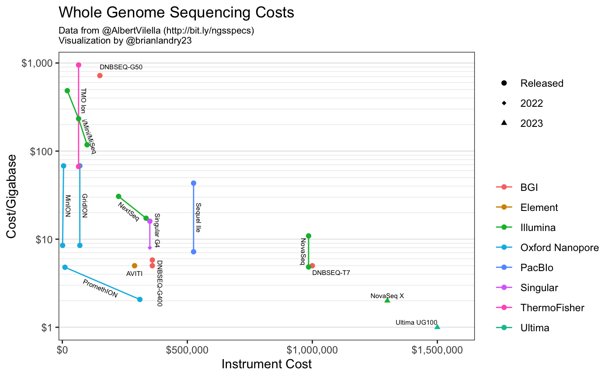

# DNA Sequencing Costs Plots

## Cost Per Read

## Cost Per Gigabase

## Data Sources

### Illumina

- Machine costs are from [Albert Vilella's GSheet](https://t.co/TDn5J0glhi)
- Cost per Gigabase from [Albert Vilella's GSheet](https://t.co/TDn5J0glhi)
- Cost per million reads are calculated from [https://www.illumina.com](https://www.illumina.com)

### Ultima

- Machine cost is fairly sketchy, its from [an unsourced tweet](https://twitter.com/GenoMee/status/1538939196345294852?s=20&t=1tey6L2l49Je1NaEXYqM_g)
- Cost per Gigabase from [Albert Vilella's GSheet](https://t.co/TDn5J0glhi)
- Cost per million reads are calculated based on \$1/Gb and 300bp reads
  - 1\$/1,000,000,000bp * 300bp/1 read = \$0.30/1MM reads$

### Nanopore

- Machine costs are from [Albert Vilella's GSheet](https://t.co/TDn5J0glhi)
- Kits costs are from [Nanopore's website](https://store.nanoporetech.com/us/promethion-flow-cell-packs-r10-5.html). Since they have transparent bulk pricing both the high and low end of the pricing is plotted.
- Cost per million reads are calculated based on their quoted number of 250 million reads per [Promethion flow cell](https://nanoporetech.com/about-us/news/oxford-nanopore-announces-technology-updates-nanopore-community-meeting?utm_campaign=K21015%20NCM%2021%20online&utm_content=191209349&utm_medium=social&utm_source=twitter&hss_channel=tw-37732219)

### Element Biosciences

- Machine costs are from [Albert Vilella's GSheet](https://t.co/TDn5J0glhi).
- Cost per Gigabase from [Albert Vilella's GSheet](https://t.co/TDn5J0glhi).
- Cost per million reads are from a [tweet by Element's CEO](https://twitter.com/MollyminHe/status/1535976799330455552?s=20&t=9CjSO39LLOX6BApQnfJT9Q).
  
### Singular Genomics

- Machine costs are from [Albert Vilella's GSheet](https://t.co/TDn5J0glhi)
- Cost per Gigabase from [Albert Vilella's GSheet](https://t.co/TDn5J0glhi).
- Cost per million reads are from [a tweet by Albert Vilella](https://twitter.com/AlbertVilella/status/1535964679557750784?s=20&t=9CjSO39LLOX6BApQnfJT9Q)

### Genapsys

- Machine, cost per gigabase and cost per reads from [Albert Vilella's GSheet](https://t.co/TDn5J0glhi)

### ThermoFisher

- Machine and cost per gigabase from [Albert Vilella's GSheet](https://t.co/TDn5J0glhi)

### PacBio

- Machine and cost per gigabase from [Albert Vilella's GSheet](https://t.co/TDn5J0glhi)

### BGI

- Machine and cost per gigabase from [Albert Vilella's GSheet](https://t.co/TDn5J0glhi)
